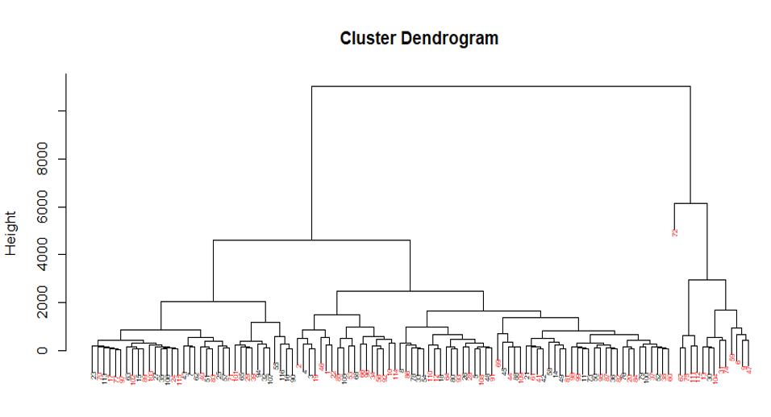
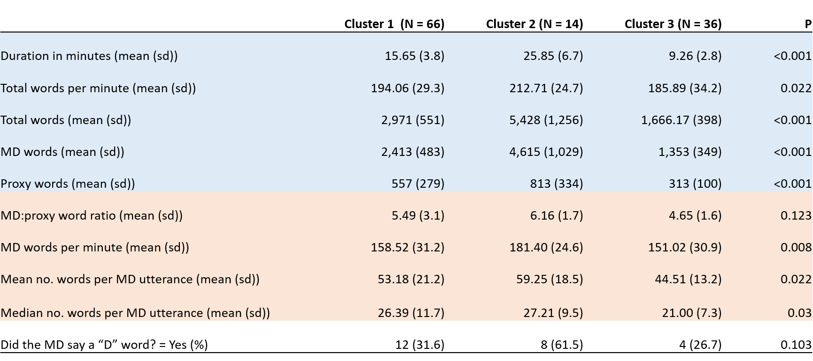
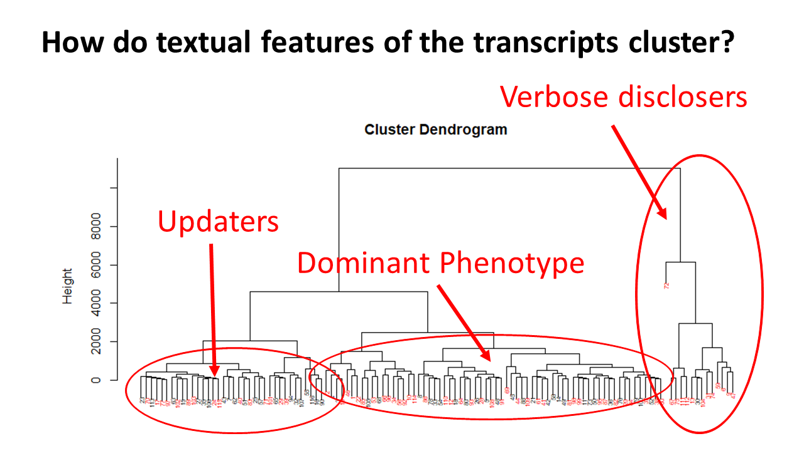
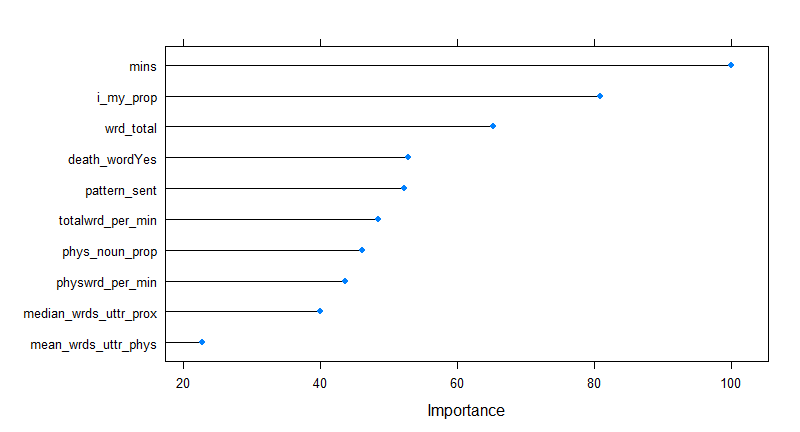
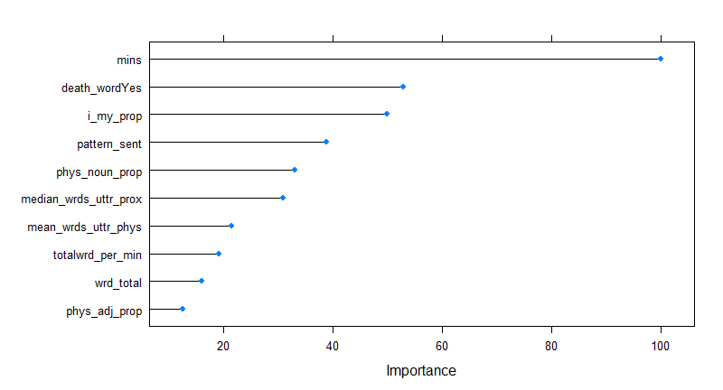
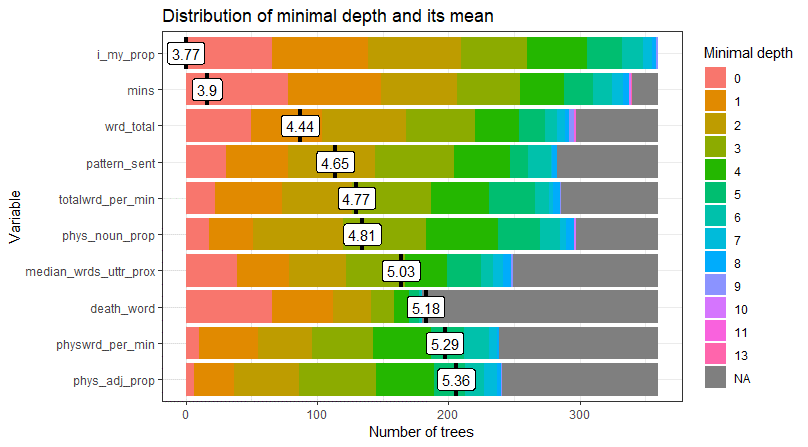

## 140.712 Final Project by Alison Turnbull
#### 12/14/2018

In the United States, many people are treated in intensive care units (ICUs) in the final months of their lives.  For some people, ICU care is appropriate and helpful.  But many people with incurable diseases would prefer to be awake and at home with their families at the end of their lives, even if that means dying sooner.  To ensure that patients and their families know about their options when they're at high risk of dying the [**Choosing Wisely**](http://www.choosingwisely.org/) campaign made the following recommendation in 2014: 

> [*"Don’t continue life support for patients at high risk for death or severely impaired functional recovery without offering patients and their families the alternative of care focused entirely on comfort."*](http://www.choosingwisely.org/clinician-lists/critical-care-societies-collaborative-life-support-for-patients-at-high-risk-for-death-or-severely-impaired-functional-recovery/)

Before patients and their families can make an informed choice about the kind of care that's best for them, they have to know that they're at high risk of dying. And while most doctors want families of their critically ill patients to know this, [many aren't sure what to say, or don't know how to say it, or fear making families sad or angry](https://www.ncbi.nlm.nih.gov/pmc/articles/PMC5059504/).  As a result, prior research has shown that [family members of ICU patients frequently do not understand how likely their loved one is to die](https://www.ncbi.nlm.nih.gov/pubmed/27187301). 

[During a randomized trial my team conducted in 2016](https://www.piperscience.org/scip), we audio-recorded 116 ICU doctors from around the country talking to actresses portraying the daughter of a single hypothetical elderly man at high risk of dying in the ICU.  These ICU physicians were instructed to interact with the actress however they normally would given the patient's clinical condition. These meetings were transcripted and deidentified, creating 116 text documents of varying length. Blinded ICU physicians reviewed each transcripts and answered the question: *"Did this intensivist communicate that the patient may die as a result of his current illness despite treatment?"*

In this analysis, I explored 31 features used to describe the text of each transcript, many of which were generated by my colleague [Gary Weissman, MD, MSHP](https://www.med.upenn.edu/apps/faculty/index.php/g353/p6504556) at UPenn. Thanks Gary!

**Examples of the text features:**  
* Duration of simulation (minutes)   
* Ratio of words spoken by MD vs by proxy  
* Physician words per minute  
* Median number of words in a MD “utterance”  
* Proportion of MD words in the VOA Special English Word List  
* The Flesch-Kincaid score of the physician text (grade level)  
* Net average sentiment in physician text (positive or negative)  
* Degree of future temporal orientation of the physician text   
* Proportion of words that are “he” or “his”  
* Proportion of physician words which are verbs  
* Did the MD ever say “death”, “die”, or “dying”?  

I sought to answer the following questions: 

**1. Are there patterns in the way physicians in this study talked to family members during the simulated family meetings?**  
        a. Are there textual features within the simulation transcripts that cluster together? If so, how can the clusters be described?  
        b. Are there physician characteristics that correlate with clusters created by text features?  
        c. Do clusters correlate with how actors or blinded physician colleagues interpreted the doctors in the study?  

**2. Which textual features best predict whether the blinded physician colleagues thought prognosis for survival was disclosed?**  
        
To address the first question I used hierarchical clustering.  Distance matrices were created using euclidean and manhattan distances (it didn't make a difference).  

After "cutting" this dendogram at 4,000 I looked at which textual features differed across the three resulting clusters.  

All the rows in blue are similar in that they relate to how long the conversation continued.  The doctors in cluster 2 stayed in the room for a mean of 26 minutes, while the doctors in cluster 3 stayed in the room for a mean of only about 9 minutes.  Cluster 1 was in the middle. 

The rows in orange relate to how much the doctor dominated the conversation and how quickly they spoke.  Here we see Cluster 2 dominating the conversation with 6 words for every 1 word spoken by the actress playing the patient proxy compared to 4.6 words in Cluster 3.  

Finally we see in the last row that physicians in Cluster 2 were about twice as likely to use the words death, die, or dying. 

**Are there correlations between text clusters and physician characteristics?**

The short answer here is no.  You can't guess how a doctor's going to interact with a patient in this sample based on age, gender, or what kind of hospital they work in.

**Do clusters correlate with how actors or blinded physician colleagues interpreted the doctors in the study?**

Yes.  All but 1 of the physicians in cluster 2 disclosed prognosis to the family as opposed to about half in the other clusters according to the blinded physicians reading the transcripts. Also, the actors participating in the simulations thought that all the physicians tried to help them understand the patient's health issues, but only those in clusters 1 and 2 listened to them or tried to include what mattered most to them in choosing what to do next for the patient.  

So, here's my hypothesis based on these findings:   
Cluster 2 is composed of doctors who enter the simulation with the goal of disclosing prognosis and spend a lot of time and words doing so. They control and dominate the conversation, but the actresses still felt listened to.  I'm calling them "verbose disclosers."  

Cluster 1 contains doctors who just intend to give the family an update on how the patient is being treated, but either don't intend to disclose prognosis, or don't know how to, or don't want to engage the family in making any decisions about treatment.  They're normally in the room for only about 10 minutes, and the actors didn't feel like these doctors listened or tried to involve them. I'm calling these doctors "updaters."  
Finally, cluster 1 is the dominant phenotype with the most physicians.  They stayed in the room longer than the updaters, about half disclosed prognosis, and they spoke less than the verbose disclosers. 

**2. Which textual features best predict whether the blinded physician colleagues thought prognosis for survival was disclosed?**  
To address this question I created 3 forms of ensemble classifiers - bagging, boosting, and random forests using the 31 textual features with the goal of classifying each transcript by whether the blinded physician reviewers reading the transcripts thought that prognosis had been disclosed as assessed by their response to the question: *"Did this intensivist communicate that the patient may die as a result of his current illness despite treatment?"*.  I then looked at variable importance for all 3 of the techniques as well as mean minimal depth for the random forests.  

**Bagging**

**Boosting**

**Random Forests**

While the ability of simulation duration in minutes and the presence of the words death, die, and dying to classify transcripts is not surprising, I was VERY surprised to find that the proportion of the physician's words which were either "I" or "my" were so powerful.  To understand this better, I went back to the transcripts themselves.  Looking at a couple examples was illustrative.  

Here's an exceprt from a doctor for whom 3% of his or her words were either "I" or "my."

>*M.D.:  I think that he’s going to pass away despite what we’re doing.  I’m really, really worried about him.  Do you want to talk to her?  Do you want me to talk to her?  I know this is not good news.  And I wish I had good coming, but I really. . .like I said, I don’t think we have to change a lot now.  I think we can see how he does and have another sit down meeting and talk about everything we’re seeing.  We’ll talk with her, too and get everybody here that needs. . . that loves him and wants to hear it, because I don’t want you to have to tell everyone, okay?  I want to talk to them, too, and tell them what’s going on because this is not good.  And I want to do right by him and I don’t want to think that we’re giving up.  I’m just worried the medicine’s failing, okay?  Like I said, I wish I had. . . I wish I had something different we could talk about.   So who else is there that loves him that you want to be here?*

And here's an excerpt from a doctor for whom <1% of words were "I" or "my."

>*Yeah, so he does have a pneumonia. It’s pretty bad.  You know. . . the work that the ventilator is doing versus the work that he’s doing. . . I mean, he’s really needing a lot of support from the ventilator right now.  The other thing. . . it does look like he also has an infection in his blood.  And that way. . . we culture the blood.  We see if anything is going to grow and he does. . and you know. . . increased from the kidney transplant, his immune system has been suppressed as part of that process which is a portion of why he’s more susceptible to not only getting infection, but also for them to be pretty bad infections.  So overall, unfortunately, it looks like he’s needing more and more support right now.  You know. . . he’s. . . as far as from a head to toe, and it sounds like you have a pretty good sense of what’s going on. . . so we have had him sedated, so you’re right.  We’re not able to really see what he’s doing neurologically. . . you know. . . it’s one of those things. . . he needs so much support from the ventilator that it’s hard for us to let him be more awake than he is. . .*

Interestingly, the doctor who doesn't say I or my, does say "we" and "us" a number of times in that quote.  

As a next step, I'd like to look at the ratio of I/my to we/us pronouns and think more about why this might correlate with disclosing prognosis.  One hypothesis is that saying "I" and "my" shows ownership and confidence.  Perhaps those doctors who are least fearful and most confident are also the doctors who are able to clearly disclose prognosis.  

#### Required Links:  
[RMarkdown file](https://github.com/aeturnbull/140.712_Final/blob/master/20181204_Final.Rmd)  
[HTML file](https://github.com/aeturnbull/140.712_Final/blob/master/20181204_Final.html)  
Data could not be shared for this project due requirements to protect confidentiality for all study participants.  Please speak to Professor Hicks about this if there are questions during grading. 
[Screencast](https://youtu.be/brOlIdLpyq8)